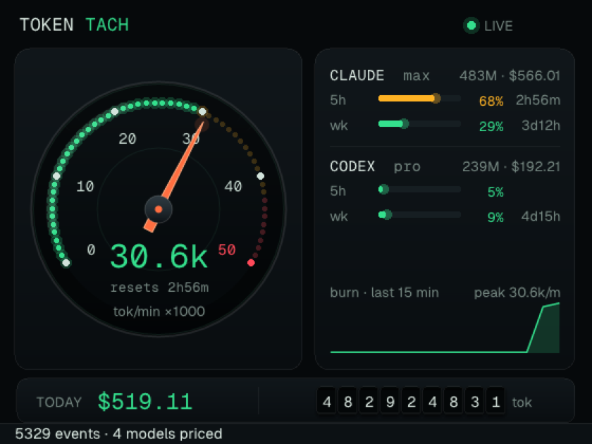
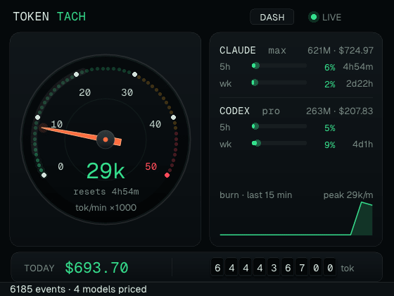
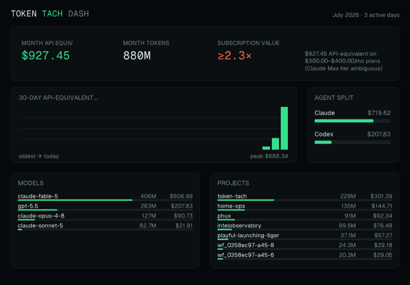

# token-tach

A macOS menu-bar tachometer for AI coding-agent token usage and subscription
limits. It reads the session ledgers your agents already write — no proxy,
no accounts, no telemetry — and turns them into an instrument.

```
⚡ 50.7k/m → wall 3:40p          ← the menu bar, all day
```

One click:



And yes — the needle does the full ignition sweep every time you open it:



## What it shows

- **Burn rate** — limit-weighted tokens/minute (cache reads at 0.1×, because
  that's roughly how they press on your quota), decayed over a 15-minute
  window. The needle.
- **Predicted wall** — "at this pace you hit a limit at 3:40 PM", projected
  from the *slope of the vendors' own utilization numbers*, not guessed
  token capacities.
- **Window utilization** — Claude 5-hour / weekly (server truth) and Codex
  5-hour / weekly (embedded in its own logs), with reset countdowns and
  threshold coloring.
- **Today's spend** — API-equivalent dollars for all tracked usage, priced
  against LiteLLM's model database, on a mechanical odometer. OpenCode usage
  contributes API-equivalent value; it is not claimed as subscription-covered.
- **History dashboard** — a second native window with this month's spend,
  subscription-value multiple, 30-day cost bars, and top model/project
  attribution:


- **Alerts and CLI** — hysteresis notifications at configured thresholds,
  plus `--json` / `--statusline` for scripting and Claude Code statuslines.

## Why it's fast

The binary is **~2.4 MB** — no Electron, no webview, no JS runtime. Native
Zig on [Native SDK](https://github.com/vercel-labs/native), drawing every
pixel through Metal.

- **Cold launch**: window up instantly; months of JSONL history parse in
  byte-budgeted 30 ms background chunks (~600 ms total) that never block a
  frame.
- **Warm launch**: tailer offsets and ledger rollups persist to an atomic
  state file, so the next launch restores in **~2 ms** and re-reads only
  what grew.
- **Steady state**: the 2-second sweep costs **~0.1 ms** when nothing
  changed (dir-mtime + hot-file detection; full re-walk only every 30 s).

## How it's built (the fun parts)

- **The popover is a patched framework.** Native SDK had a tray API but no
  `NSPopover`, no dock-less mode, no launch-at-login — so this repo vendors
  [a fork](https://github.com/phall1/native/tree/token-tach-patches) that
  adds all three to its Objective-C AppKit host, with the popover reparenting
  the app's Metal surface in and out of an `NSViewController`.
- **The needle is real geometry.** The widget grammar rasterizes rects
  axis-aligned, so the blade is a tapered vector path drawn through the
  chrome display-list seam — the one primitive that stays true under the
  render-animation rotation channel. Rest pose is always truth; animations
  replay only deltas.
- **Server-truth limits, no scraping.** Claude's 5h/weekly utilization comes
  from the same OAuth endpoint Claude Code's `/usage` uses. Codex is even
  better: it writes its `rate_limits` straight into its rollout files —
  zero network for OpenAI numbers.
- **Everything is fixture-tested.** ~100 tests over the UI-free core
  (tailers, pricing, prediction, ledger, config, state), and `scripts/verify`
  launches the real app headlessly, toggles the actual popover, walks the
  accessibility tree, and screenshots it — locally and in CI.

## Where the data comes from (the trust story)

**Local files, read-only, by default:**

| Source | What | How |
|---|---|---|
| Claude Code | tokens per message | tails `~/.claude/projects/**/*.jsonl` (and `$CLAUDE_CONFIG_DIR`), dedupes on `message.id:requestId` |
| Codex CLI | tokens **and** 5h/weekly limit % | tails `~/.codex/sessions/**` — limits are embedded in the logs |
| OpenCode | tokens per assistant message | opens one `opencode.db` read-only, selecting only usage/model/time IDs plus the joined session directory; prompt/content/tool/auth data is never queried |
| Pricing | $/token rates | bundled snapshot of LiteLLM's `model_prices_and_context_window.json` |

**Opt-in (`claude-oauth = true`):** Claude's server-truth utilization via
`GET https://api.anthropic.com/api/oauth/usage` with your existing Claude
Code OAuth token (read from the Keychain item `Claude Code-credentials`
via Apple's `security` tool — macOS asks for consent). Polled every 180 s,
exponential backoff on 429. The request carries your token and standard
headers, nothing else, to that host and no other. The app never writes to
the Keychain. Off by default.

## Install

Homebrew is the canonical distribution channel:

```sh
brew install --cask phall1/tap/token-tach
```

Releases are Universal 2, Developer ID signed, notarized, and updated through
both Homebrew and the app's signed Sparkle feed.

To build from source instead:

```sh
git clone --recurse-submodules https://github.com/phall1/token-tach
cd token-tach
scripts/setup                          # hooks, submodules, toolchain, fork CLI
vendor/native/zig-out/bin/native build
open zig-out/bin/token-tach            # or scripts/release for a .app/DMG
```

The same notarized DMG is also available from
[GitHub Releases](https://github.com/phall1/token-tach/releases).

It's an accessory app: no Dock icon — look for the glance in the menu bar.
Left-click for the cluster, right-click for quick stats and Quit.
Use the Dashboard menu item or the popover's `DASH` button for history.

## Configure

`~/.config/token-tach/config` — plain `key = value`, ghostty-style,
**live-reloaded** (edit it and watch the tray re-template within a tick):

```ini
# the menu-bar template: {burn} {eta} {pct} {tok} {cost}
tray-format = {burn} → {eta}

claude-oauth = true        # opt in to server-truth Claude limits
poll-interval = 180s
alert-threshold = 70, 90
source = claude, codex, opencode # enable/disable agents
# claude-config-dir = ~/some/other/claude-root
# codex-home = ~/.codex
# opencode-db = ~/.local/share/opencode/opencode.db
```

## Development

```sh
scripts/verify   # check + test + build + headless popover smoke drive
native dev       # hot-reloading dev run
```

See `docs/DEVELOPMENT.md` for the loop, the SDK's built-in agent docs, and
the vendored-fork rebase procedure.

```
src/core/       UI-free engine: tailers, pricing, ledger, prediction, oauth, state
src/engine.zig  the TEA loop: timers → sweep → ledger/burn/walls → display
src/view.zig    the instrument cluster (canvas + vector chrome)
src/dashboard.zig history dashboard window
src/cli.zig     --json / --statusline local snapshot mode
src/main.zig    shell: scene, status item, popover, runtime entry
```

## Status

v0.3: history dashboard, notifications, and local-only CLI/statusline mode.
Follow-up work is tracked in [beads](https://github.com/steveyegge/beads)
(`bd list`).

## License

MIT. Not affiliated with Anthropic, OpenAI, or Vercel.
