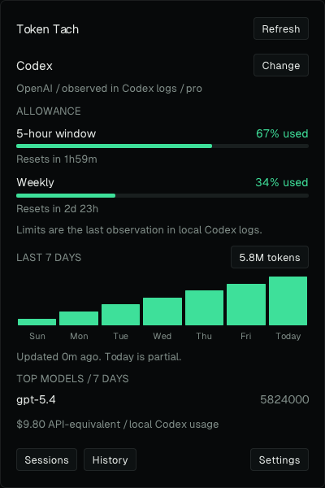
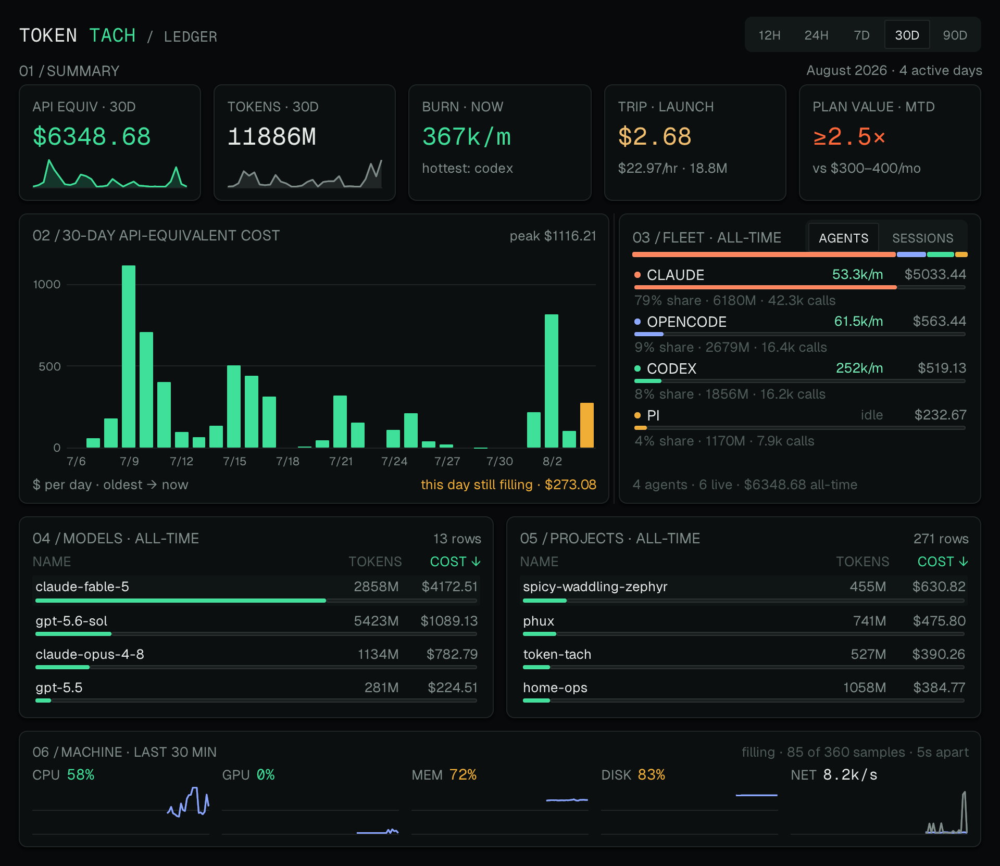

# token-tach

A macOS menu-bar monitor for coding-agent allowance and usage. It reads the
session ledgers your agents already write — no proxy, tracking account or telemetry.

```
Codex 67%                      ← fresh allowance, when available
8.2M tok today                 ← recorded-usage fallback
```

One click shows allowance, reset times, seven days of usage and top models:



Choose a harness to see its local usage. Provider allowance is shown alongside
it when available; local usage is never assumed to belong to a subscription
just because a model name matches. Sessions and History are one click away.

## What it shows

- **Allowance first** — Claude 5-hour / weekly (opt-in OAuth) and Codex
  5-hour / weekly (observed in local logs), with reset countdowns. Readings
  older than five minutes or past their reset stay visible as stale and stop
  driving the default menu-bar percentage.
- **Seven-day usage** — recorded tokens including cache, split by harness,
  and top models over the same period. Backed by the durable archive, including
  after restart. Today is partial; archive timezone differences are disclosed.
- **Honest cost** — API-equivalent dollars from model pricing, not a bill or
  proof of subscription coverage. Unidentified accounts remain unidentified.
- **Recent sessions** — project, harness, model and observed activity. Transcript
  growth can suggest possible work; it does not prove an agent process is running.
- **History dashboard** — a second native window for the long view: this
  month, subscription value, day-by-day cost, and per-model/per-project
  attribution.


- **Optional instruments** — the desktop HUD, history dashboard, burn prediction,
  trip totals and custom tray telemetry tokens remain available. The default
  `{status}` template prioritizes allowance; existing custom templates still work.
- **Alerts and CLI** — hysteresis notifications at configured thresholds,
  plus `--json` / `--statusline` for scripting and Claude Code statuslines,
  and six query verbs over the durable history (below). `--json` includes
  the live system telemetry.

## What it remembers

Until now the app persisted the *identity* of every event forever (dedup
keys) and the *content* of none finer than a blended calendar day. "How
many tokens did project X burn in June" was not a question it answered
badly — it was a question it could not answer at all, because the
dimension cross-product was never on disk. `per_model` and `per_project`
were all-time cumulative with no time axis to slice.

There is now a durable time series underneath it: three tiers (a 48-hour
minute ring, plus hour and day logs that keep forever), keyed by bucket ×
agent × model × project × session. That makes per-project-per-month, and
every other cross-section, a real query:

```sh
# the query that was structurally impossible before
token-tach top --dim project --since 2026-06-01 --until 2026-07-01

token-tach history --since 30d --group project,agent
token-tach sessions --since 7d --project ~/workspace/token-tach
token-tach burn --window 15m
token-tach export --format csv --since 90d > usage.csv
token-tach doctor --history
```

Names are matched exactly, and a project is its **repository root** —
asking for one the store has never seen is a hard stop with an
explanatory note, not a filter that quietly matches nothing.

A git worktree is a different directory and the same project, so
`token-tach/.claude/worktrees/toasty-floating-marshmallow` is attributed
to `token-tach`, not to a project named after the worktree; so is a session
started in a subdirectory like `token-tach/src/core`. The root comes from
git itself (an upward walk for `.git`, so a worktree parked at an unrelated
sibling path still resolves), falling back to a path rule for directories
that no longer exist. Rows written before v0.9.6 keep their per-worktree
names: the dictionary is append-only and ids are never reassigned, so older
worktree spend appears under its own name rather than being rewritten. The
live panels re-key themselves on first launch and need no such caveat.

Records are **additive** — multiple records sharing a key sum — which is
what makes a late-arriving transcript, a six-month backfill, and a crash
mid-write all the same cheap operation, and a crash a *smaller* answer
rather than a wrong one. Minute and hour buckets are UTC so a timezone
move can't retroactively re-key them; day buckets are local, because "what
did I spend today" is a local question, and every query prints which basis
it used. See [docs/CLI.md](docs/CLI.md).

## Why it's fast

The binary is **~2.4 MB** — no Electron, no webview, no JS runtime. Native
Zig on [Native SDK](https://github.com/vercel-labs/native), drawing every
pixel through Metal.

- **Cold launch**: window up instantly; months of JSONL history parse in
  byte-budgeted 30 ms background chunks (~600 ms total) that never block a
  frame.
- **Warm launch**: tailer offsets and ledger rollups persist to an atomic
  state file, so the next launch restores in **~2 ms** and re-reads only
  what grew.
- **Steady state**: the 2-second sweep costs **~0.1 ms** when nothing
  changed (dir-mtime + hot-file detection; full re-walk only every 30 s).

## How it's built (the fun parts)

- **The popover uses a small SDK fork.** This repo vendors
  [a fork](https://github.com/phall1/native/tree/token-tach-patches-v0.10.1)
  of upstream v0.10.1 with primary-status-item `NSPopover` hosting,
  with the popover reparenting the app's Metal surface in and out of an
  `NSViewController`. Upstream handles dock-less mode and login-item services;
  the fork keeps Zig login helpers and frame-anchored render animations.
- **A small presentation interface.** Collectors feed the existing usage engine
  and durable archive. A bounded seven-day summary and typed allowance snapshot
  feed a flow-layout popover; views perform no filesystem or credential reads.
- **Server-truth limits, no scraping.** Claude's 5h/weekly utilization comes
  from the same OAuth endpoint Claude Code's `/usage` uses. Codex is even
  better: it writes its `rate_limits` straight into its rollout files —
  zero network for OpenAI numbers.
- **Telemetry is pushed, not polled.** The system strip is fed by a background
  sampler thread that owns its own counters and `post`s each reading through
  a Native SDK [external-source channel](https://github.com/vercel-labs/native) —
  the UI updates when the machine changes, on its own cadence, replay-safe,
  with no shared mutable state. Custom tray tokens and the history window expose
  those readings without adding a machine-monitor strip to the usage popover.
- **Everything is fixture-tested.** ~370 tests, ~300 of them over the
  UI-free core (tailers, pricing, prediction, ledger, sessions, history,
  config, state), and `scripts/verify` launches the real app headlessly,
  toggles the actual popover, walks the accessibility tree, and screenshots
  it — locally and in CI.

## Where the data comes from (the trust story)

**Local files, read-only, by default:**

| Source | What | How |
|---|---|---|
| Claude Code | tokens per message | tails `~/.claude/projects/**/*.jsonl` (and `$CLAUDE_CONFIG_DIR`), dedupes on `message.id:requestId` |
| Codex CLI | tokens **and** 5h/weekly limit % | tails `~/.codex/sessions/**` — limits are embedded in the logs |
| OpenCode | tokens per assistant message | opens one `opencode.db` read-only, selecting only usage/model/time IDs plus the joined session directory; prompt/content/tool/auth data is never queried |
| Pi | tokens per message | tails `~/.pi/agent/sessions/**/*.jsonl`, dedupes fork re-logs |
| Gemini CLI | tokens per response | tails `~/.gemini/tmp/*/chats/*.jsonl`; cache reads are a subset of prompt tokens and never double count |
| Qwen Code | tokens per response | tails `~/.qwen/{projects,tmp}/**/*.jsonl` |
| Kimi CLI | tokens per call | tails `~/.kimi/sessions/**/wire.jsonl` (model id not logged — counted, unpriced) |
| Goose | tokens per call | reads the `usage_ledger` table of `sessions.db` read-only |
| Kilo Code | tokens per turn | reads `~/.local/share/kilo/kilo.db` read-only (usage fields only, never content) |
| Cline | tokens per request | snapshots `~/.cline/data/sessions/*.messages.json` and legacy VS Code task stores |
| Roo Code | tokens per request | snapshots the Roo VS Code task store (`ui_messages.json`) |
| Pricing | $/token rates | bundled snapshot of LiteLLM's `model_prices_and_context_window.json` |

Every collector is zero-config (auto-discovered if the harness's data
exists, silent if not), read-only, and exact — token counts come from the
harnesses' own logs, never estimated. `token-tach --json` reports per-source
coverage — enabled, detected, events, and the span the history store has
seen it over — so you can see exactly what is and isn't being counted.
Harnesses that don't persist exact local token data
(Cursor, Windsurf, Grok Build, Amazon Q, ...) are deliberately excluded —
the full matrix, including honest gaps, lives in
[docs/COVERAGE.md](docs/COVERAGE.md).

**What it writes (all local, all yours):** two things under
`$XDG_STATE_HOME/token-tach/` — `~/.local/state/token-tach/` when that
variable is unset — mode 0600 inside a 0700 directory:

| Path | What | Notes |
|---|---|---|
| `tailers.json` | tailer byte offsets + ledger rollups | a cache. Delete it and the next launch re-derives everything from the transcripts. |
| `history/` | the durable time series (`dict.log`, `hot.ring`, `hours.log`, `days.log`) | **not** a cache — the agents rotate and delete their own transcripts, so this is the only copy. |

The history store is the one genuinely new write behavior, so, concretely:
64-byte fixed records, one per (bucket × agent × model × project ×
session); the minute ring is capped at 4 MiB and the hour/day logs grow.
Single-digit megabytes a year is the shape of it for typical use — heavier
before the store compacts itself, which it does at most once per launch
when duplicate keys exceed a quarter of the records or a tier passes
32 MB. A single writer holds `history/.lock` via `flock`; a second
instance logs once and runs inert rather than corrupting anything. Files
that fail their header check are *quarantined* to `<name>.bad.<ms>`, never
deleted, because a corrupt tail may be surrounded by months of readable
history worth recovering by hand. Nothing here leaves the machine, and
`token-tach doctor --history` will tell you exactly what is in it.

**Opt-in (`claude-oauth = true`):** Claude's server-truth utilization via
`GET https://api.anthropic.com/api/oauth/usage` with your existing Claude
Code OAuth token (read from the Keychain item `Claude Code-credentials`
via Apple's `security` tool — macOS asks for consent). Polled every 180 s,
exponential backoff on 429. The request carries your token and standard
headers, nothing else, to that host and no other. The app never writes to
the Keychain. Off by default.

## Install

Homebrew is the canonical distribution channel:

```sh
brew install --cask phall1/tap/token-tach
```

Releases are Universal 2 and ad-hoc signed. Homebrew handles first-install
quarantine compatibility and is the supported update path.

To build from source instead:

```sh
git clone --recurse-submodules https://github.com/phall1/token-tach
cd token-tach
scripts/setup                          # hooks, submodules, toolchain, fork CLI
vendor/native/zig-out/bin/native build
open zig-out/bin/token-tach            # or scripts/release for a .app/DMG
```

The same DMG is also available from
[GitHub Releases](https://github.com/phall1/token-tach/releases).

It's an accessory app: no Dock icon — look for the glance in the menu bar.
Left-click for the cluster, right-click for quick stats and Quit.
Use the Dashboard menu item or the popover's `DASH` button for history.

## Configure

`~/.config/token-tach/config` — plain `key = value`, ghostty-style,
**live-reloaded** (edit it and watch the tray re-template within a tick):

```ini
# the menu-bar template: {status} {burn} {eta} {pct} {tok} {cost}
#                        {cpu} {gpu} {mem} {disk} {net} {batt}
tray-format = {status}

claude-oauth = true        # opt in to server-truth Claude limits
poll-interval = 180s
alert-threshold = 70, 90
# enable/disable agents (default: all). Known: claude, codex, opencode,
# pi, gemini, qwen, kimi, goose, kilo, cline, roo
source = claude, codex, opencode
system-stats = true        # or a list: cpu, gpu, mem, disk, net, battery
launch-at-login = true     # login item (installed app); unset = never touched
# claude-config-dir = ~/some/other/claude-root
# codex-home = ~/.codex
# opencode-db = ~/.local/share/opencode/opencode.db
```

## Development

```sh
scripts/verify   # check + test + build + headless popover smoke drive
native dev       # hot-reloading dev run
```

See `docs/DEVELOPMENT.md` for the loop, the SDK's built-in agent docs, and
the vendored-fork rebase procedure.

```
src/core/       UI-free engine: tailers, pricing, ledger, prediction, oauth, state
src/core/history.zig   the durable time series (three tiers, additive records)
src/core/sessions.zig  the live agent-session roster (incl. the mid-turn signal)
src/engine.zig  the TEA loop: timers → sweep → ledger/burn/walls → display
src/view.zig    the instrument cluster (canvas + vector chrome)
src/dashboard.zig history dashboard window
src/hud.zig     the always-on-top HUD window
src/cli.zig     --json / --statusline / --bench + the six query verbs
src/main.zig    shell: scene, status item, popover, runtime entry
```

## Status

v0.9 (in flight): a durable local time series, so per-project-per-month
and every other cross-section is answerable for the first time; a live
agent-session roster with a mid-turn signal; per-agent burn; 30 minutes of
system telemetry on a wall clock; a trip odometer; six CLI query verbs
(`history`, `burn`, `top`, `sessions`, `export`, `doctor`); vendored SDK
rebased onto upstream v0.8.0.
v0.8: pushed system telemetry via a Native SDK external-source channel;
hover-reveal detail on every strip cell.
v0.7: rebased onto Native SDK v0.6; dashboard accuracy pass (honest
subscription-value multiple, synchronous timezone resolution, live system
strip from the first frame).
v0.6: the collector fleet — 11 zero-config usage sources.
v0.5: system telemetry (CPU/GPU/mem/disk/net/battery) joins the cluster.
v0.3: history dashboard, notifications, and local-only CLI/statusline mode.
Follow-up work is tracked in [beads](https://github.com/steveyegge/beads)
(`bd list`).

## License

MIT. Not affiliated with Anthropic, OpenAI, or Vercel.
